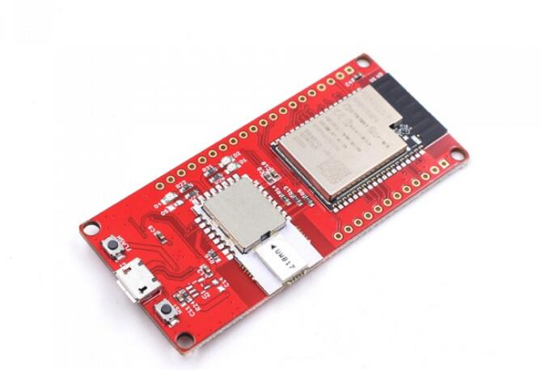

# Makerfabs ESP32 UWB DW3000

**The DW3000 library in this repository was developed by NConcepts, not Makerfabs.  Makerfabs is simply responsible for maintaining the repository.**

```c++
/*
Version:        V1.0
Author:            Vincent
Create Date:    2022/8/1
Note:
    2023/3/18    V1.1:Modify the SPI operating frequency in the library.
                      Added software reset to demo.
*/
```



[TOC]

# Makerfabs

[Makerfabs home page](https://www.makerfabs.com/)

[Makerfabs Wiki](https://makerfabs.com/wiki/index.php?title=Main_Page)

# Makerfabs ESP32 UWB DW3000

## Intruduce

Product Link ：[esp32-uwb-dw3000](https://www.makerfabs.com/esp32-uwb-dw3000.html) 

Wiki Link : 

Makerfabs ESP32 UWB contains an ESP32 and a DW3000 chip.

Ultra-wideband (UWB) is a short-range, wireless communication protocol that operates through radio waves, enables secure reliable ranging and precision sensing, creating a new dimension of spatial context for wireless devices.

Makerfabs ESP32 UWB module, which is based on IC DecaWave DW1000, has been greatly popular and liked by many Makers. And many customers ask us for the newest DW3000 version, after long-term comparison & testing, now it's available!~

Compares to the DWM1000, the DWM3000 has advantages as below:

1. Most important: Interoperable with Apple U1 chip, that makes it possible to work with the Apple system;
2. Fully aligned with FiRa™ PHY, MAC, and certification development, which make it more suitable for further applications;
3. Much lower Power consumption, almost 1/3 of DWM1000;
4. Supports UWB channels 5 (6.5 GHz) and 9 (8 GHz), while DWM1000 does not support Channel 9;

## Feature

- Integrated ESP32 2.4G WiFi and Bluetooth.
- DW3000 UWB module.

## Software

This is the code provided by the customer, which can realize the basic message sending and receiving. 

If you want to use ranging, you can try using the following code:

```c
Dw3000\examples\ex_06a_ss_twr_initiator\ex_06a_ss_twr_initiator.ino

Dw3000\examples\ex_06b_ss_twr_responder\ex_06b_ss_twr_responder.ino
```

The EX_06A_SS_TWR_INITIATOR shows the distance after downloading the two UWB DW3000 separately.
