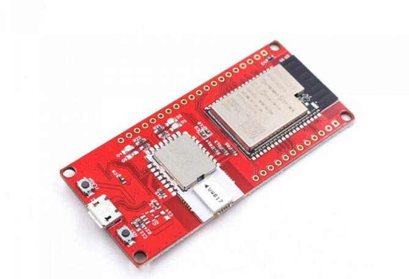

# Makerfabs ESP32 UWB DW3000

**The DW3000 library in this repository was developed by NConcepts, not Makerfabs.  Makerfabs is simply responsible for maintaining the repository.**

```c++
/*
Version:        V1.2
Author:            Vincent
Create Date:    2022/8/1
Note:
    2023/5/5     V1.2:The routines that can be used are placed in 
                    the example folder separately, with instructions 
                    added.
    2023/3/18    V1.1:Modify the SPI operating frequency in the library.
                      Added software reset to demo.
*/
```



[TOC]

# Makerfabs

[Makerfabs home page](https://www.makerfabs.com/)

[Makerfabs Wiki](https://wiki.makerfabs.com/)

# Makerfabs ESP32 UWB DW3000

## 1.Intruduce

Click the image below to watch the demonstration on YouTube.

[](https://www.youtube.com/watch?v=JwxK1K1YVI8)

Product Link ：[esp32-uwb-dw3000](https://www.makerfabs.com/esp32-uwb-dw3000.html) 

Wiki Link : [ESP32 UWB DW3000](https://wiki.makerfabs.com/ESP32_DW3000_UWB.html)

Makerfabs ESP32 UWB contains an ESP32 and a DW3000 chip.

Ultra-wideband (UWB) is a short-range, wireless communication protocol that operates through radio waves, enables secure reliable ranging and precision sensing, creating a new dimension of spatial context for wireless devices.

Makerfabs ESP32 UWB module, which is based on IC DecaWave DW1000, has been greatly popular and liked by many Makers. And many customers ask us for the newest DW3000 version, after long-term comparison & testing, now it's available!~

Compares to the DWM1000, the DWM3000 has advantages as below:

1. Most important: Interoperable with Apple U1 chip, that makes it possible to work with the Apple system;
2. Fully aligned with FiRa™ PHY, MAC, and certification development, which make it more suitable for further applications;
3. Much lower Power consumption, almost 1/3 of DWM1000;
4. Supports UWB channels 5 (6.5 GHz) and 9 (8 GHz), while DWM1000 does not support Channel 9;

## 2.Feature

- Integrated ESP32 2.4G WiFi and Bluetooth.
- DW3000 UWB module.

# 3.Usage

ESP32 UWB DW3000 module ranging principle.


Download the DW3000 library in [GitHub](https://github.com/Makerfabs/Makerfabs-ESP32-UWB-DW3000/tree/main), and put it to the Arduino library file.

**Note: The DW3000 library in this repository was developed by NConcepts, not Makerfabs. Makerfabs is simply responsible for maintaining the repository.**

### 3.1 One Anchor + one Tag

**How to set ESP32 UWB DW3000 module as the anchor port.**

- Prepare the module and connect it to the PC with a USB cable.

- There is a sketch(range_tx.ino) for the setting, the sketch is available on [GitHub](https://github.com/Makerfabs/Makerfabs-ESP32-UWB-DW3000/tree/main). The path is >>example>>range_tx>>range_t.ino.

- Open the sketch with Arduino IDE. If you did not install the ESP32 development board on Arduino IDE, please check here for how to install it.
- Select the development board "ESP32 Dev Module" and the port.


- Upload the sketch to the board.

- This module can be an anchor port to receive the other UWB device signal.

**How to use ESP32 UWB DW3000 module to measure the distance from the anchor port.**

How to use ESP32 UWB Pro module to measure the distance from the anchor port.

- Open the sketch **range_rx** by Arduino IDE. The path is >>example>>range_rx>>range_rx.ino
- As above mentioned to install the development board and library.
- Select the development board “ESP32 Dev Module” and the port.
- Upload the sketch to the board.
- Open the serial monitor, it will print the distance from the anchor port.


### 3.2 Multi Anchor + Multi Tag

This is the example to get the distance and signal strength value from multi Tag to multi Anchor.

The network uses a designated **Master Anchor** to coordinate synchronization and network scheduling.

``` 
#define MASTER_ANCHOR_ID    0xA0
```

The Master Anchor serves as the reference node for the entire UWB network and is responsible for:

- TDMA timing coordination
- Tag scheduling reference
- Maintaining a common network time base

All Anchors and Tags in the network must be configured with the same `MASTER_ANCHOR_ID`.


**Set the board to Anchor X or Tag X**

Open the [Tag](https://github.com/Makerfabs/Makerfabs-ESP32-UWB-DW3000/tree/main/example/Multi%20Anchor%20%2B%20Multi%20Tag/tag) and [Anchor](https://github.com/Makerfabs/Makerfabs-ESP32-UWB-DW3000/tree/main/example/Multi%20Anchor%20%2B%20Multi%20Tag/anchor) by Arduino IDE.

Modify code to get the Anchor or Tag that you want to define

``` 
// 0xA0~0xA7
#define MASTER_ANCHOR_ID    0xA0
```

``` 
//For example 0, 1, 2..
#define TAG_ID              0
```

Use Type-C USB cable to connect the board and PC, and select the development board "ESP32 Dev Module" and the port.

Verify the code and upload.

Repeat to set up multiple Anchor and multiple Tag.


Open the port for any anchor to view the distances from all tags to all anchors.


Results for 8Tag + 8anchor

